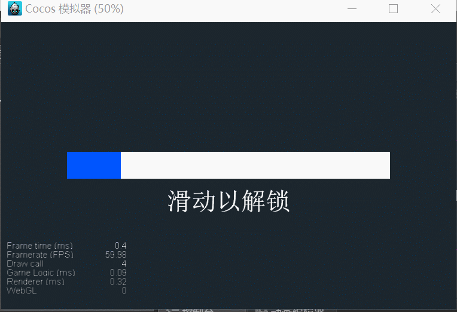

- Creator 版本: v2.1.0
- 平台: 模拟器
- 语言: Typescript

## 今天突然想做一个类似 iPhone 的滑动以解锁.



## 首先想到使用 Creator 自带的 cc.Slider 组件, 在 Slide 事件中获取 Slider 的 progress, 遇到了问题:

1. 如果 handle 设置的比较大会发现在进度条最左端或最右端会出现 handle 挪出了背景框

   解决方案: 将 Slider 的 background 向左右加长

2. 点击在 cc.Slider 的进度条上会使 handle 移动, 然而我们并不需要这种效果

   解决方案:

   - (不推荐)
     ```javascript
     start() {
       cc.eventManager.pauseTarget(sliderNode);
     }
     ```
   - (推荐)
     ```javascript
     start() {
       this.node.targetOff(sliderNode);
     }
     ```

   因为 Slider 的有些事件可能是注册在 onLoad 后, 所以我们把取消 Slider 监听的函数写在 start 中来避免一些未知错误

3. 没有滑到最右端时 Slider 的回弹

   最近正好在琢磨 Physics 组件的玩法, 所以想到一个骚操作就是用 Joint 将 Slider 和 handle 连接起来, 不过后来还是用一个简单的 action 解决了

   ```javascript
   var springBack = cc.moveTo(0.1, cc.v2(-this.node.width / 2, 0));
   this.silderHandle.node.runAction(springBack);
   ```

4. 对滑到最右端松手的处理

   如果只是简单地检测 handle 的 touchend 事件, 如果手指滑出了 handle 就无法触发了, 所以同时还要检测 handle 的 touchcancel 事件(当手指滑出 handle 节点的范围时触发), 详细代码在下方给出

## 整体代码如下:

```javascript
/* slider.js */
const { ccclass, property } = cc._decorator;

@ccclass
export default class Slider extends cc.Component {
  @property(cc.Slider)
  slider: cc.Slider = null;

  @property(cc.Button)
  silderHandle: cc.Button = null;

  onLoad() {
    this.slider = this.node.getComponent(cc.Slider); // get slider component

    this.slider.progress = 0; // set slider progress to 0
    this.silderHandle = this.slider.handle; // get handle of the slider
    this.silderHandle.node.on(
      cc.Node.EventType.TOUCH_END,
      function(event) {
        this.callback(event);
      },
      this
    ); // trigger when touch ended on handle
    this.silderHandle.node.on(
      cc.Node.EventType.TOUCH_CANCEL,
      function(event) {
        this.callback(event);
      },
      this
    ); // trigger when touch ended and moved out of handle
  }

  callback(event) {
    cc.log(this.slider.progress);
    if (this.slider.progress == 1) {
      cc.director.loadScene('next');
    } else {
      // this.slider.progress = 0;
      var springBack = cc.moveTo(0.1, cc.v2(-this.node.width / 2, 0));
      this.silderHandle.node.runAction(springBack); // handle spring back to initial position
    }
    console.log(event);
  }

  start() {
    this.node.targetOff(this.slider); // prevent slider touch event
  }

  // update (dt) {}
}
```

## 将代码绑定到 Slider 所在节点进行微调即可实现滑动以解锁的效果.
